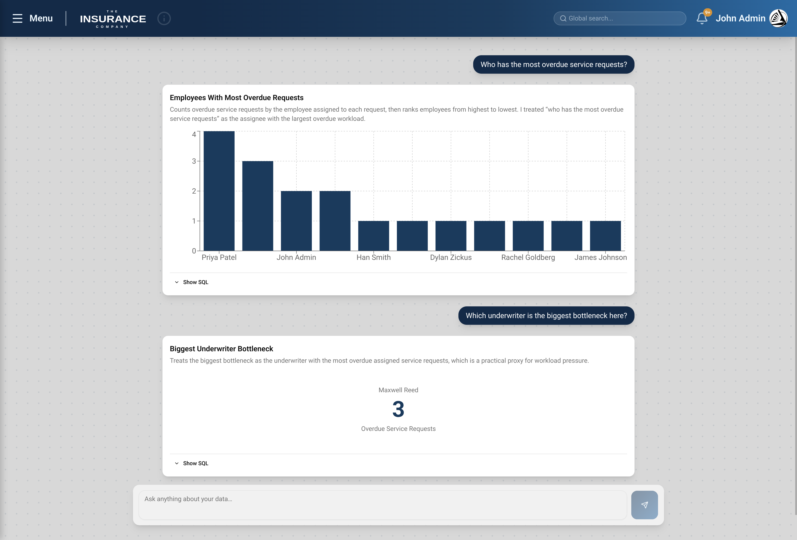
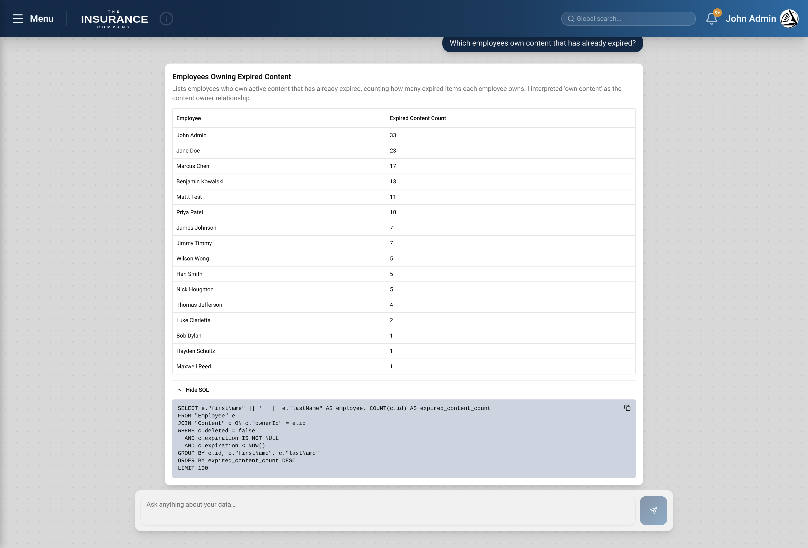
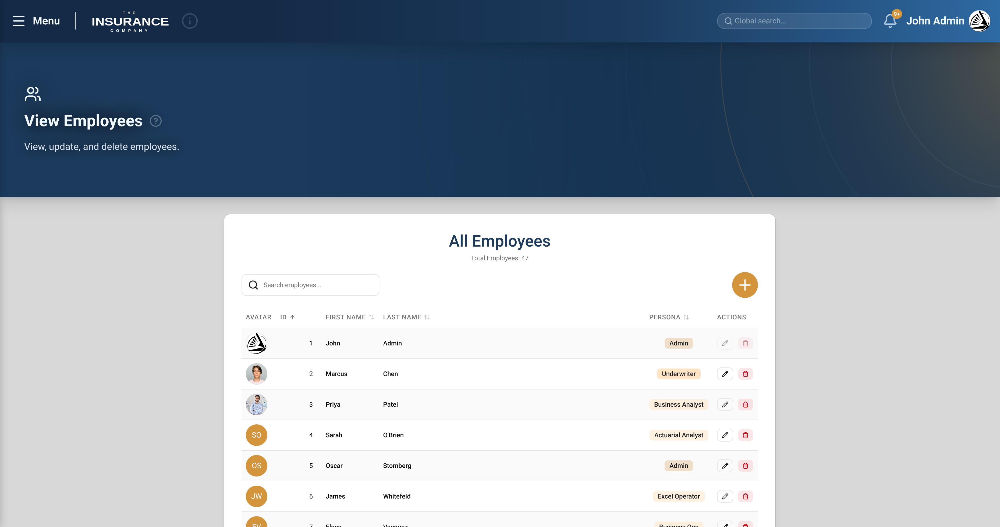
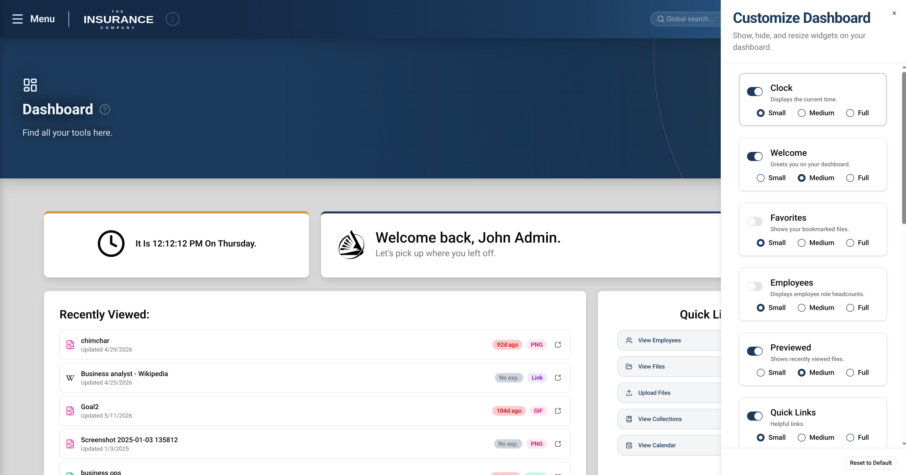
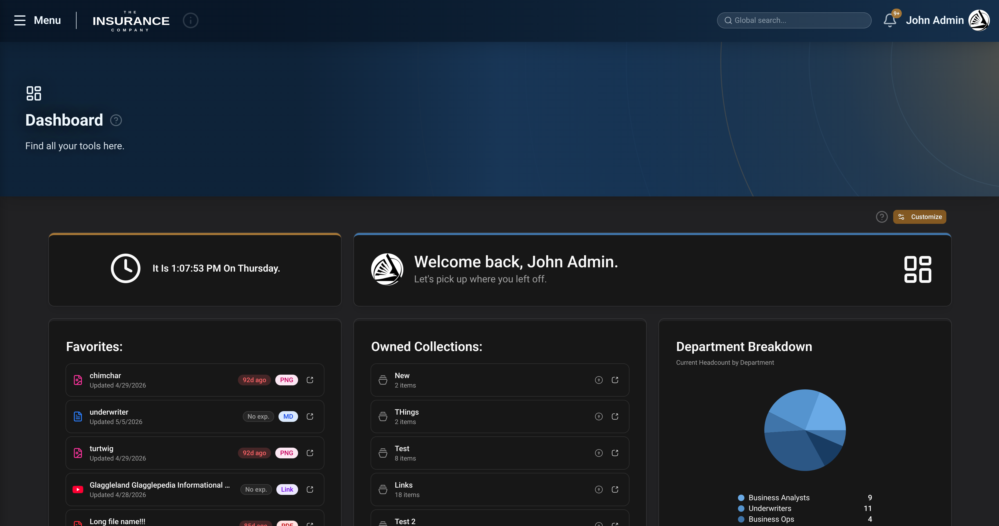
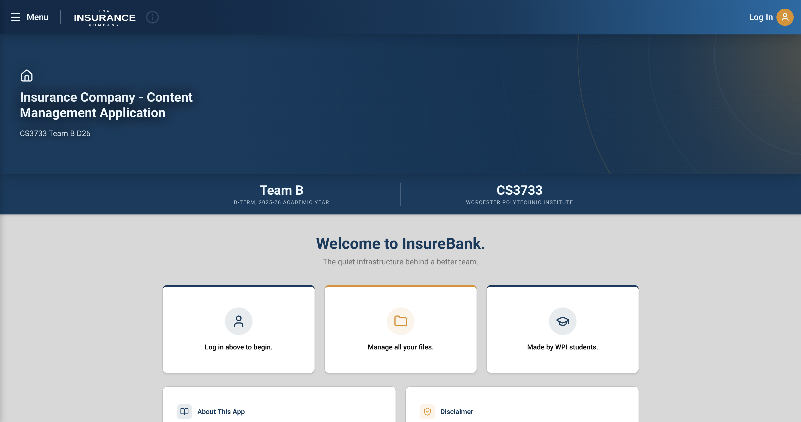

# Insurance Content Management Application

Content management and analytics platform built for The Hanover Insurance Group
(NYSE: THG) in CS3733 Software Engineering at WPI: **Team B, D-term 2026**,
10-person agile team.

## About this fork

**Fork Author:** Hayden Schultz (schultzh06) 

This is a fork of a team repository. The full codebase is preserved here for
context; the work below is mine.

**Role:** Assistant Lead Software Engineer, Scrum Lead

**AI Insights (NL→SQL):** built end to end. OpenAI backend integration, an LLM
system prompt describing the DB schema, Zod-constrained structured outputs for
consistent request/response shapes, and an SQL safety parser that validates
generated queries before execution. Frontend chat interface plus the result
chart and scorecard renderers.



*A follow-up question resolves against the previous turn — "here" refers to the prior result set — and the renderer dispatches to a scorecard instead of a chart based on the shape the model returns.*



*Every result exposes the generated SQL. The query is validated against a read-only allowlist before it reaches the database.*

**Authentication:** integrated Auth0 with JWT, route protection, and a React
context hook exposing the current user across components. This replaced an
earlier iteration-1 system I wrote using local storage with password hashing and
a login gate.

**Employee management:** employee management page, modify/delete flows, profile
settings, and profile picture upload.



*Employee CRUD with Auth0 management API provisioning on create, and displays user-managed profile photos. Administrators have access to user actions to modify names and roles, and can delete employee records from the interface as well.*

**Dashboard:** widget grid setup, then a refactor to sortable and resizable
widgets. Dashboard graphs.



*Widgets are toggled and sized per employee; the layout is persisted as JSON on the employee record and restored on next load.*



*The saved layout rendered — sortable, resizable widgets with the graphs in their selected sizes. The user has also opted for dark mode in this screenshot, found in settings.*

**Frontend foundation:** shadcn/ui and Tailwind setup, navigation bar, sidebar
and avatar user dropdown, home page and hero, about page, settings page, and
site themes. 

**Styling:** ongoing restyling across every iteration for consistency with the
team style guide: color palette revisions and component design passes.



*Landing page, navigation, and hero. Unauthenticated users see the login gate; routes are protected by JWT.*

**Non-coding:** contributed to iteration documents and presentation decks,
presented iteration 2, presented the final iteration 5 demonstration to The
Hanover Insurance Group, and ran daily scrum meetings.

Everything else — global search, service requests, collections, recycle bin,
bulk upload, notifications, i18n — was built by other team members.

---

## Tech stack

- **Frontend** — React + TypeScript + Vite, Tailwind, shadcn/ui primitives, Recharts, Auth0
- **Backend** — Express 5 + TypeScript (ESM), port `3000`
- **Database** — PrismaORM against PostgreSQL (Supabase)
- **File storage** — Supabase Storage (buckets: `content`, `profiles`)
- **Auth** — Auth0 (JWT via `express-oauth2-jwt-bearer`) + Auth0 Management API for provisioning users
- **Package manager** — pnpm, exclusively (never `npm`)
- **Monorepo** — pnpm workspaces + Turborepo
- **Deployment** — Render.com (single web service, `render` branch)

---

## Getting started

```bash
pnpm install
pnpm --filter @softeng-app/db exec prisma generate
pnpm dev                                              # runs backend + frontend
```

Backend-only: `pnpm run --filter backend dev`. Migrations: `cd packages/db && pnpm prisma migrate dev`.

### Environment variables (`.env` at repo root)

```
DATABASE_URL=                   # Postgres connection string (Prisma)
NEXT_PUBLIC_DATABASE_URL=       # Same value, exposed for frontend tooling (codebase quirk — not a Next.js project)
SUPABASE_URL=
SUPABASE_ANON_KEY=
AUTH0_MGMT_CLIENT_ID=
AUTH0_MGMT_CLIENT_SECRET=
OPENAI_API_KEY=                 # Required for NL-query (POST /api/nl-query)
ML_SERVICE_URL=                 # Embedding microservice URL (default: http://localhost:3001)
```

The Auth0 tenant (`<tenant>.us.auth0.com`) and API audience are hardcoded in `app.ts` and `helpers/auth0Management.ts`.

---

## Full Documentation and Architecture

To view full documentation of feature suite and project architecture, please visit:

[**ARCHITECTURE.md**](/docs/ARCHITECTURE.md)